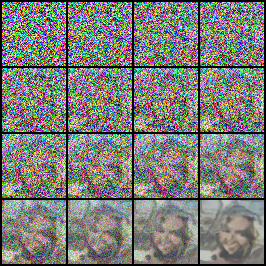
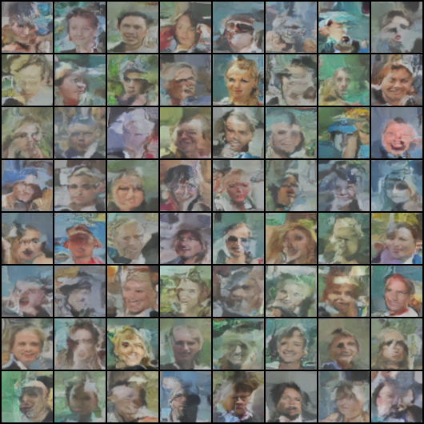

# Diffusion model

Simplified architecture using only a U-Net backbone, Accelerated the noising process with DDIP (Denoising Diffusion Implicit Models). To promote in-depth understanding of model operation, implements code from scratch.

## 1. Detail
* Dataset
  * CelebA (Celeb Faces and Atrributes Dataset)
  * Apply augmentation, which is contains rotation and crop, h-flip with probability.
  * Using entire 202,599 images to train not split it.
* Model
  * Using Unet as base model.
  * Residual block and GeLU conv block to efficient training.
  * Rearrange pooling to minimize information loss.

## 2. Result
* Train batch size 64 and epoch 10 (31,650 iters), beta range from 0.0001 to 0.02 and 256 time steps.
  
  

* Result images generated from random noise samples. Some faces are quiet recognizable, however, the overall model generating quality is still lacking. These results may be due to a lack of learning epochs or data, but stopped learning here and implement better performance with a model with a different architecture.

  

## 3. Conclusion

Learn about the architecture and overall flow of the diffusion model, which predicts noise for denoising by forward processing noisy images. The diffusion model was more convenient in the learning process because it clearly revealed whether it was being learned compared to the GAN model.

- Future Work:
  - Classifier-free diffusion model
  - Fast Training of Diffusion Models with Masked Transformers
