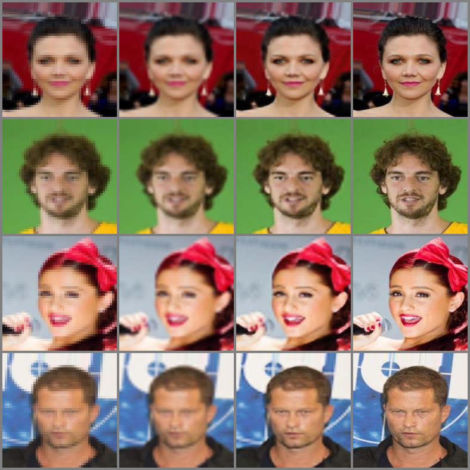
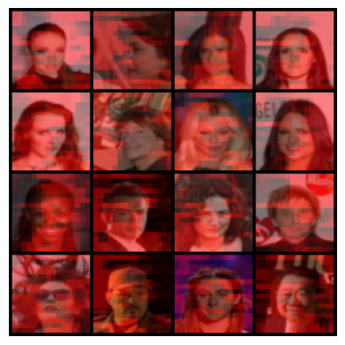
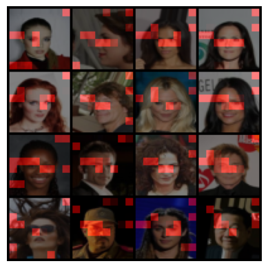

# Vision Transformer based SuperSampler

## 1. Dataset
- Use CelebFaces Attributes Dataset(CelebA).
- **202,599 face images** of the size 178×218.
- Train with 90% and test with 10% of whole dataset.

## 2. Objective
- Understand architecture of **Vision Transformer**.
- Understand how **Multi-head Self Attention** works and visulize it.
- Classify face images by gender.

## 3. Train
Results after one epoch with 32 batch size which equals to 5,698 iters. MSE loss for upsampling with bicubic method is about 0.0075, as goal of this experiment.

### Trial 01
- 5.72it/s, total loss=3.52 for 634 iters
- Without positional Embedding and skip connect upsampled input image by nearest method. Loss after about 6,500 iters is 0.00539, which is smaller than bicubic upsampling error.

### Trial 02
- 5.79it/s, total loss=3.33
- Without positional Embedding and skip connect upsampled input image by bicubic method.

### Trial 03
- 5.25it/s, total loss=3.27
- With positional Embedding and skip connect upsampled input image by bicubic method. After 3 epochs, the total loss dropped to 2.89. The result image shows that the model outperforms the standard interpolation method in terms of quality and loss. (Left to right: Down-sample, bicubic-interpolation, my model, ground truth)

  

## 4. Analysis
Multi-head Self-Attention (MSA) layers use queries, keys, and values to determine which patches should attend to the target patch. The attention mechanism is governed by the dot product of Q and K, which selects the relevant patches to extract information from, so decide to visualize it and check see how it works.

### Visualize QK
- Visualize the non-self attention patches in each MSA layer, ignoring the QK diagonal matrix. Most of the Heads failed to capture specific patterns and attended to the whole image. The heatmap below shows the layer respectively focusing on background.

  

- Two possible causes for the lack of diversity across layers:
  1. The number of Heads (16) was insufficient, leading to feature overlap.
  2. The patches were too small (3x3) to capture meaningful features. 
   
   Address the second cause and retrained the model with respectiv larger patches (6x6) on a 48x48 image. This improved the performance of MSA, as shown by the layer that selectively attended to the eye region.

  

## 4. Conclusion
 While implementing a super-sampling model based on ViT could explore the patch-wise multi-head self-attention mechanism of Vision Transformer. Moreover, it had the benefit of being able to access information from any part of the image, regardless of the distance, overcoming the locality issue.